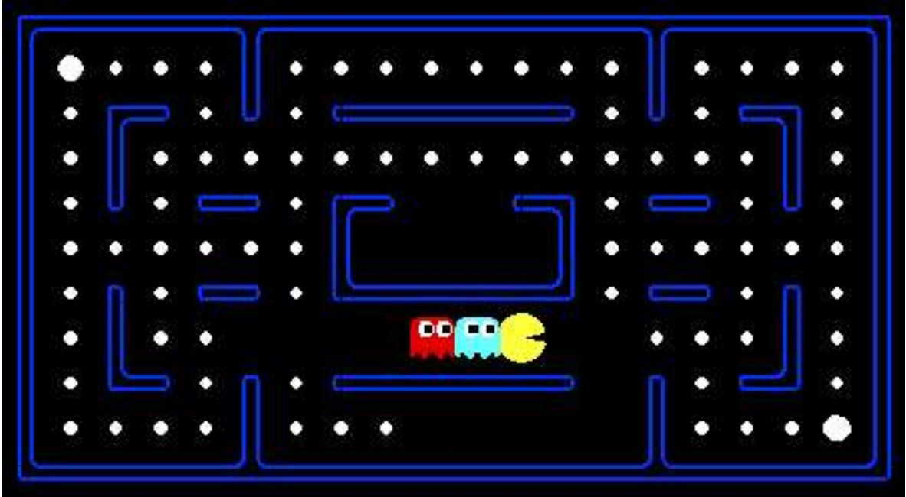

# AI Pacman Project 🕹️
This project focuses on implementing adversarial search algorithms in artificial intelligence, particularly for playing the Pacman game. Below, you'll find an overview of the key concepts, code structure, and evaluation functions used in this project.

## Adversarial Search 
Adversarial search is employed to resolve two-person games where one player aims to maximize their score, while the other seeks to minimize it. The primary focus is on developing algorithms for decision-making in competitive settings with conflicting interests.

## Game Tree 
A game tree visually represents all possible actions and consequences in a two-player game using adversarial search. Nodes in the tree represent different states of the game, and search algorithms like minimax are often applied to determine optimal player moves.

## Minimax Algorithm 
The Minimax Algorithm is a recursive decision-making approach that assumes optimal play by opponents. It explores the game tree to evaluate all possible moves and outcomes, making the best decision for a player.

## Alpha-Beta Pruning 
To address time constraints in Minimax, alpha-beta pruning is introduced. It optimizes the search by stopping the examination of successors when their values cannot affect the final result.

## Code Structure 
`multiAgents.py` This file contains the implementation of AI agents for playing Pacman using adversarial search algorithms.

`better_evaluation_function` This function evaluates the given game state and returns a numerical score. It considers various factors, including the score of the state, distances to ghosts, foods, and capsules.

## How to Run
1. Clone the Repository:
```bash
git clone https://github.com/SheidaAbedpour/multi-agent-search.git
```
2. Install Dependencies
```bash
pip install -r requirements.txt
```
3. Run the AI Agent
```bash
python pacman.py -p AIAgent -k 1 -n 10 -a depth=4 -g DirectionalGhost
```
- `-p`: Specifies the use of the AI agent.(`AIAgent`)
- `-k`: Specifies the ghosts number (`1` or `2` ghosts in environment).
- `-n`: Specifies the number of games to play (change as needed).
- `-a depth=x`: Specifies the depth parameter for the Minimax algorithm (change as needed).
- `-g`: Specifies the ghost behavior (`DirectionalGhost` or `RandomGhost`).

## Gameplay Overview 🎮👻
"Pacman" is a classic arcade game that was first released in 1980 by Namco (Japanese video game developer). It was designed by Toru Iwatani and became one of the most iconic and enduring video games in history. The game has been widely ported to numerous platforms and has inspired many variations and adaptations.
The main objective of Pacman is to navigate a maze, consume all the pellets, and avoid or eat ghosts. The player aims to achieve the highest score possible.



### Rules 📜
- Eating Pellets: Pacman moves through the maze, eating pellets along the way. Each pellet eaten adds points to the player's score.
- Avoiding Ghosts: Ghosts move throughout the maze, trying to catch Pacman. If a ghost catches Pacman, Pacman loses a life.
- Power Pellets: Eating Power Pellets allows Pacman to temporarily turn the tables on the ghosts. While ghosts are vulnerable, Pacman can eat them for additional points.


## Credits
This Pacman AI project is inspired by and extends the Pacman AI projects developed at [UC Berkeley](http://ai.berkeley.edu).
- Developers: [John DeNero](denero@cs.berkeley.edu), [Dan Klein](klein@cs.berkeley.edu).
